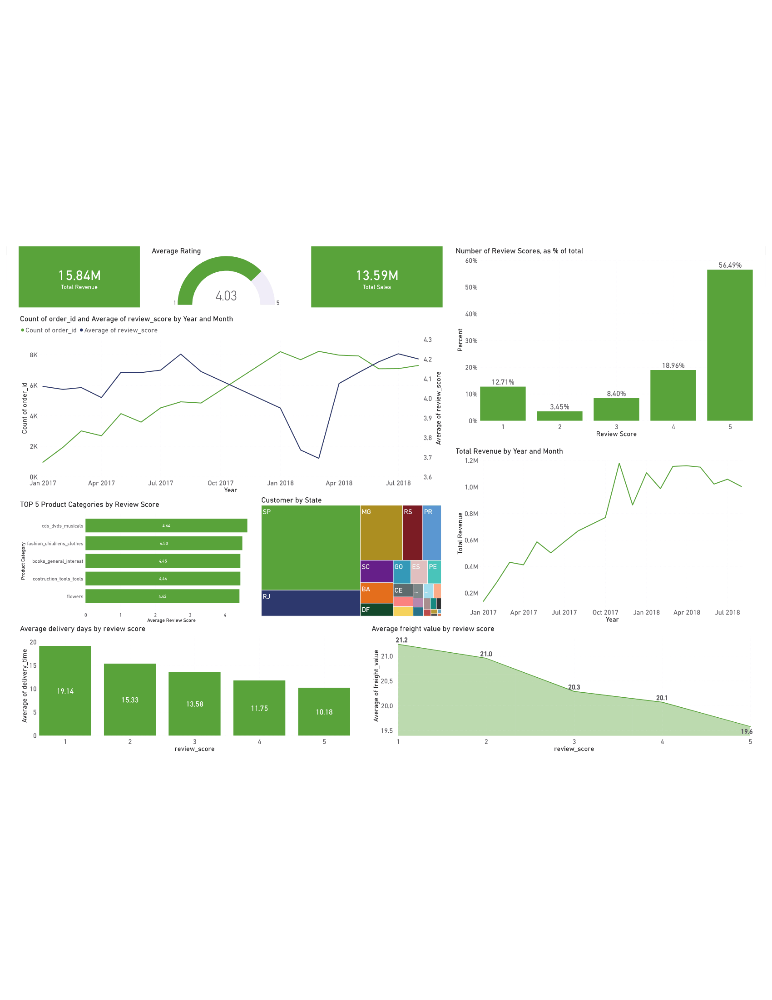

# Factors Influencing Customer Satisfaction in E-Commerce (Olist)

Data analysis project investigating what drives customer satisfaction (CSAT) for Olist, a Brazilian online marketplace, using the public Olist e-commerce dataset.

## Question

### What factors — delivery, price, product characteristics, sellers — most influence whether a customer leaves a high review score (4-5 stars)?

## Approach
* Data prep (SQL + Python): joined 7 raw tables (orders, items, customers, products, reviews, sellers), cleaned inconsistent categories, timestamps, and missing values.
* Feature engineering: created delivery-time metrics (approval time, time to carrier, time to customer, delivery delay), order size, seller and product-category performance rankings, and a binary "satisfied" target.
* Analysis: linear & logistic regression, multiple regression, and Random Forest (regressor + classifier) to identify the strongest drivers of satisfaction; K-means clustering for customer segmentation.
  
## Tools: Python (pandas, scikit-learn, statsmodels, seaborn), SQL, Power BI.

## Key Findings
Delivery delay and total delivery time are the two biggest drivers of customer satisfaction — the longer or later an order arrives, the lower the review score.
Secondary factors (product weight, freight cost, payment installments, seller/product-category quality) have a smaller but measurable effect.
Customer segments identified via clustering differ mainly by spend level and region.

## Business Recommendation
Improving delivery speed and reliability — especially avoiding delays past the estimated date — is the highest-leverage lever for boosting customer satisfaction.

## Power BI Dashboard
To complement the Python/SQL analysis, I built an interactive Power BI dashboard to make the findings accessible to non-technical stakeholders.

What it shows:

* Overview KPIs — total revenue (15.84M), total sales (13.59M), and average rating (4.03)
* Review score distribution, showing the majority of orders (56%) receive a 5-star rating
* Revenue and order volume trends by month
* Average delivery time by review score, confirming faster deliveries correlate with higher ratings
* Average freight value by review score, showing higher shipping costs align with lower ratings
* Top 5 product categories by review score
* Customer distribution by state (São Paulo and Rio de Janeiro dominate)

## Files
Technical_Submission_Final.ipynb — full analysis notebook (data prep, EDA, statistical modeling, machine learning)
images/powerbi_dashboard.png — Power BI dashboard screenshot
